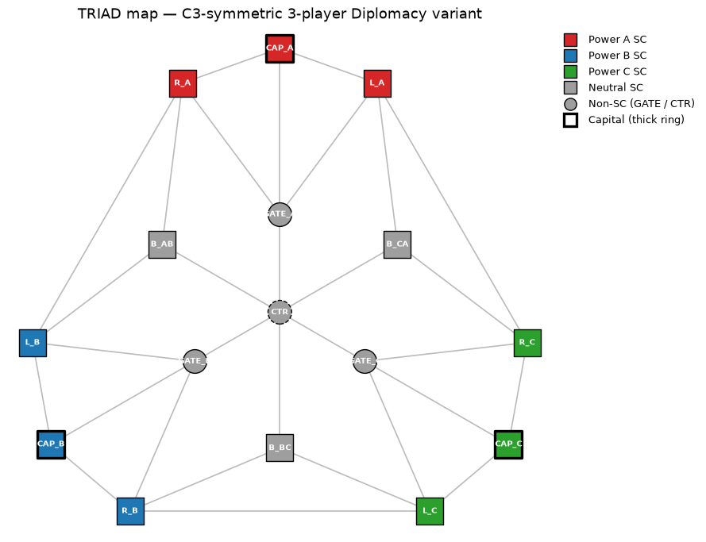
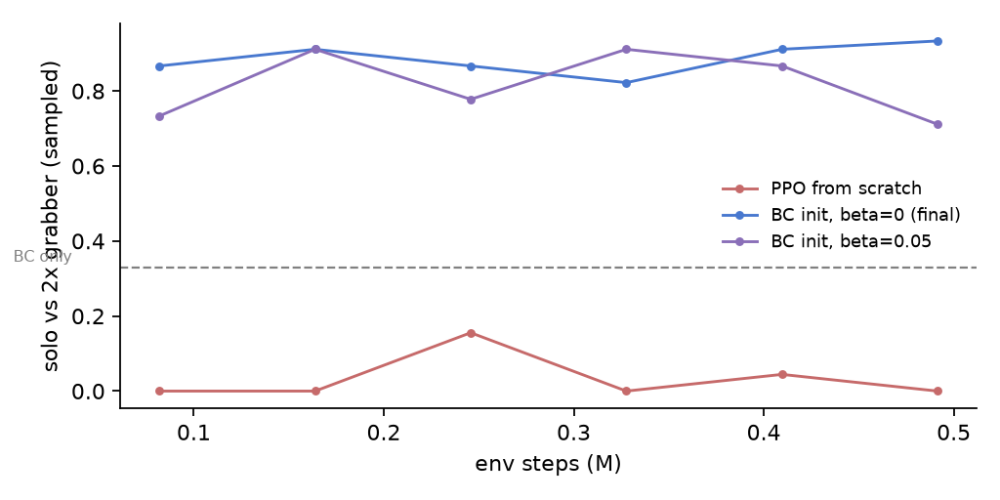
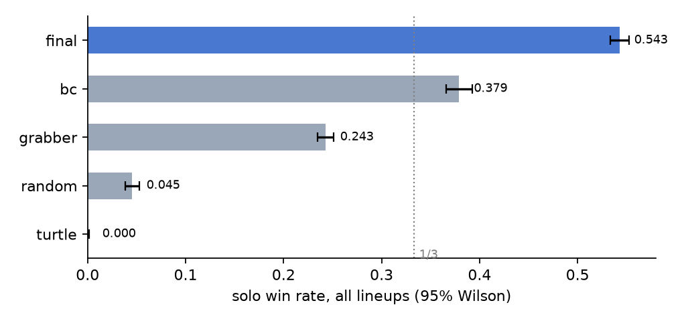
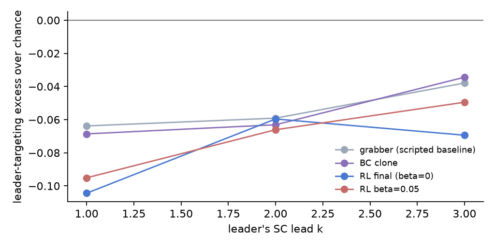
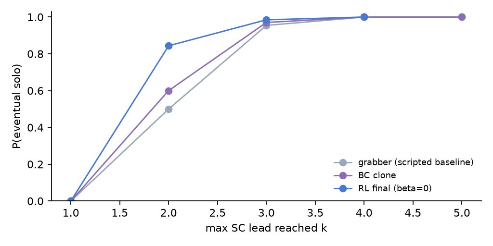

# TRIAD-RL

**Does balance-of-power emerge from self-play RL in a symmetric 3-player game with no communication?**

Srirang Nabar · July 2026

- Custom Diplomacy variant, engine → BC → PPO+KL, all built & verified from scratch
- 115 tests · 10,800-game tournament · every number reproducible from a `git clone`
- **Answer: no — and the agents learn the opposite (with a clean incentive story)**

---

# 1 · Why this game



- **3 players** = the minimum for "who do I attack?" to be strategy, not arithmetic
- **No press** → any coalition must be *implicit*, learned from incentives alone
- **Exact C3 symmetry** (verified graph automorphism) → rotate every observation *and action* into the actor's own frame → **one network, three seats, zero seat input**
- Armies only, no retreats — deviations chosen so adjudication is a provable fixpoint

---

# 2 · System, built for correctness first

- Pure-python engine, Kruijswijk adjudication: support cuts, head-to-head, beleaguered garrison, circular movement, retroactive voids
- **DATC-adapted test suite** + property tests: unit conservation, determinism, **C3 equivariance on 10k random positions** · ~390 games/sec
- Autoregressive order decoder (GRU over emitted orders, hard legality masks over a 336-order vocab) — per-unit heads can't coordinate supports
- Repro contract: CPU-portable state-dict checkpoints, SHA256 manifest, CI plays every shipped checkpoint, `--smoke` on every script

---

# 3 · The pipeline works



| | vs 2×Grabber |
|---|---|
| BC clone | 32.8% (= teacher parity) |
| **BC + PPO** | **92.4%** |
| PPO from scratch | 2.8% / 13.6% |

- **DipNet's "scratch fails" reproduces** at equal budget — 7–30× from the imitation bootstrap
- 500k env-steps ≈ 35 min on a laptop CPU; every experimental row at the same budget

---

# 4 · Tournament (10,800 games)



- final: **54.3%** of all seats played; **93.4% vs 2×Grabber @2000 games**; ≥⅓ of every pairing
- clean ladder: final > bc > grabber > random > turtle (TrueSkill concurs)
- turtle: never wins, draws 27% — defence survives but can't convert
- **seat-symmetry χ²: p = 0.234 @2000 games**

---

# 5 · The test that earned its keep

*Identical policies in all seats ⇒ equal win rates. Cheap χ². Ran it routinely.*

- **Bug 1 (M3):** decode *order* wasn't rotation-preserved → stable C>A>B, pooled p≈10⁻⁴ → fixed, regression-tested
- **Bug 2 (M4):** the *action vocabulary* was never rotated — identical obs, seat-dependent masks → weight sharing silently broken since day one. β=0 exposed it (p≈10⁻⁸); a trajectory-rotation experiment pinned it in 12/12 trials
- Fix dropped BC val loss **0.73 → 0.38** — the old task was unlearnable
- Lesson: content, outcome, and **interface** equivariance are three different properties; statistical invariance tests catch all three

---

# 6 · Headline I: nobody hunts the leader



- Raw leader-targeting is confounded (the leader owns more board) → report **excess over a target-blind null**, against a score-blind scripted baseline
- Excess **negative everywhere** — and *more* negative for RL (−0.10) than the baseline (−0.06)
- Trained agents pick on the **weaker** neighbour: prey-selection, not balancing

---

# 7 · Headline II: leads snowball, coalitions never form



- P(solo | 2-SC lead): grabber 0.50 → bc 0.60 → **RL 0.84** — no lead-braking
- Cross-power supports ≈ **zero** in every competent config (β=0: 0.3% of orders)
- The **KL anchor actively suppresses** the coalition channel (monotone in β) — the anchor's teacher never helps neighbours; predicted at planning time, confirmed at 400 games/config

---

# 8 · Why: a free-rider story

- Stopping the leader = **public good** between the two trailers: private cost, shared benefit
- Attacking the other trailer = **private gain**
- No communication, no identity, no punishment ⇒ nothing stabilises contribution ⇒ independent learners converge on prey-selection + snowballing
- The one quasi-balancing regime seen anywhere: **α=0, β=0 → draw-attractor** (119/150 self-play draws) — cooperation by universal stalemate, not coalition
- Classical balance-of-power presupposes machinery (signalling, reputation) this game deliberately lacks — *that's the finding*

---

# 9 · Limitations & what I'd do next

- **Budget**: 500k steps/run, laptop CPU — scratch & sweep rows may differ at 10–100× (checkpoints are cloud-portable; extension is mechanical)
- **Map decisiveness**: 7-of-12 falls fast; a slower map gives balancing room — the 5-player Pentad config is the designed follow-up
- **Reward design**: solo-heavy scoring prices aggression; relative-position rewards could move the equilibrium
- One seed per grid row (conclusions lean on cross-row consistency; game-level numbers carry CIs)

---

# 10 · Reproduce everything

```bash
git clone <repo> && cd Diplomacy_RL
uv sync && uv run pytest -q          # 115 tests incl. shipped-weights checks
uv run python scripts/run_tournament.py
uv run python scripts/run_bop_metrics.py
uv run python scripts/make_report_figs.py
```

- Weights ship in-repo (SHA256 manifest); CI loads and plays each one
- 4 executed notebooks carry the full narrative, bugs included
- Built July 3–6, 2026 · target was Aug 10

**A rigorously measured "no", with the mechanism, beats a fragile "yes".**
